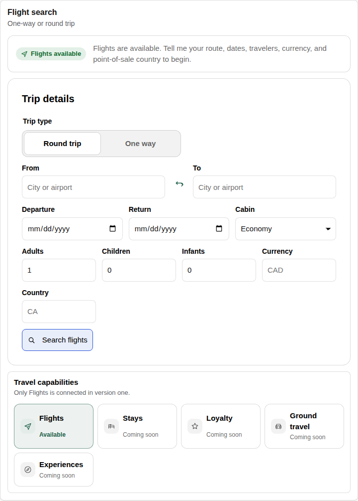
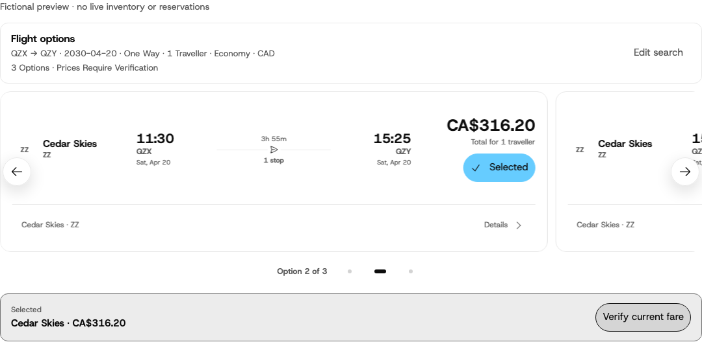
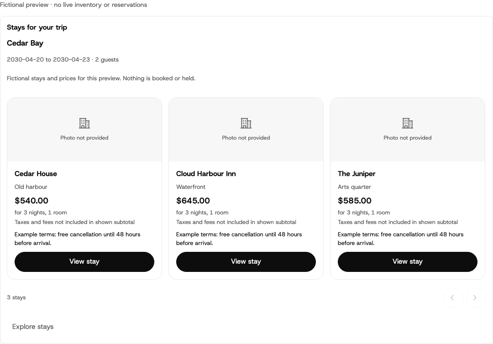
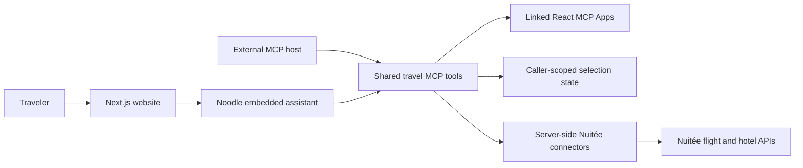

# Wayfare

[](LICENSE)
[](package.json)
[](package.json)
[](docs/architecture.md)
[](.github/workflows/ci.yml)

**One conversation. The whole journey.**

**Wayfare is an example project by [Noodle Seed](https://noodleseed.com).** It demonstrates a conversational travel experience built with a Next.js website, shared TypeScript MCP tools, and interactive travel Apps. Use it as a starter for your own agentic travel product. Noodle Seed provides the MCP and embedded-assistant foundation; Nuitée provides the configured live flight and hotel data.

Use this starter to turn trip intent into options, compare tradeoffs, remember a selection, and verify a flight fare. The same travel tools serve the website's embedded assistant and external MCP hosts.



*Actual local website, before a conversation starts. No credentials or live provider requests were used for these captures.*

## Try it without credentials

Install **Node.js 24+** and **Corepack**, then run from the repository root:

```sh
corepack enable
corepack prepare pnpm@11.17.0 --activate
pnpm install --frozen-lockfile
pnpm dev:web
```

Open [localhost:3000](http://localhost:3000). You can explore the real Wayfare homepage, destination imagery, navigation, and composer without a Noodle account or provider key. The website opens no assistant session on load. Submitting a message requires your configured embedded assistant; an unconfigured site shows setup guidance.

To explore the MCP product separately, run `pnpm dev:preview`. This opens the credential-free expanded server in local Noodle DevTools: hotels, experiences, rewards, and travel protection use clearly labeled examples; current flight search explains the missing configuration. It never substitutes fictional fares for a live flight search.

## What you can build with it

| Capability | Included behavior | Data and boundary |
| --- | --- | --- |
| Flights | Search one-way or return itineraries, compare a compact carousel, select a fare, verify its current price and availability | Live Nuitée access required; stops before reservation or booking |
| Hotels | Search stays, inspect rooms and terms, compare options, explore locations when configured, remember a selection | Live Nuitée results in the expanded live profile; illustrative stays in the credential-free profile; no room held |
| Experiences | Discover fictional Lisbon and Tokyo ideas, compare options, choose a date/time, and add an experience to the conversation's plan | Demonstration catalog only; temporary planning selections, no live operators, capacity checks, or booking |
| Rewards and reward flights | Show an example balance and compare points-based trip ideas | Illustrative only; no account access, live award inventory, or redemption |
| Travel protection | Compare example protection concepts | Illustrative only; no insurance quote, policy, eligibility decision, or purchase |
| Trip review | Review any selected flight, stay, or experiences inline and explore relevant missing components | Optional components with separate prices; preserves each source and never invents a bookable package total |

**No booking, passenger collection, payment, ticketing, cancellation, refund, voucher issuance, or points redemption is implemented.** Cars, private jets, and broader trip-care imagery are product concepts, not connected transaction capabilities. A selected option is never presented as a reservation.

### Flight comparison



### Hotel discovery



These are Chromium captures of the current React components using fictional fixtures, not live inventory or screenshots from a third-party host. The hotel preview intentionally uses the product's missing-photo fallback. [Capture provenance and reproduction](docs/images/README.md) record the source, network restrictions, dimensions, and checksums.

## How it fits together



The flight journey is Search → Select → Verify. Conversation carries intent and refinement. Bounded tools return structured facts and readable fallback text; linked Apps handle comparison and selection at the relevant point in the conversation. Provider credentials and provider offer identifiers remain on the server. The browser receives application-issued selection handles, not provider credentials.

| Location | Purpose |
| --- | --- |
| [`apps/web/`](apps/web/) | Next.js guest website and chronological embedded conversation |
| [`src/travel-server.ts`](src/travel-server.ts) | Shared capabilities, entrypoint profiles, assistant configuration, and state contracts |
| [`src/views/`](src/views/) | Real flight, hotel, experience, reward, trip-review, and protection Apps |
| [`src/flight-runtime.ts`](src/flight-runtime.ts), [`src/hotel-runtime.ts`](src/hotel-runtime.ts) | Provider normalization, safe output mapping, and selection boundaries |
| [`src/starter-config.ts`](src/starter-config.ts) | Canonical brand and deployment configuration |
| [`test/`](test/), [`apps/web/test/`](apps/web/test/) | Contract, security-boundary, component, and browser coverage |

See the [architecture guide](docs/architecture.md) for the trust boundaries and [Nuitée flight contract](docs/nuitee-flights-contract.md) for the provider mapping.

## Connect your own services

### 1. Enable live provider reads

Use your own Nuitée account and key with the required flight and hotel entitlements. A key alone does not guarantee access to every API. Use credentials entitled to the fixed Lite API endpoints; sandbox responses are not production inventory.

```sh
cp .env.example .env
# Edit the ignored .env locally and set NUITEE_API_KEY.
pnpm dev:demo
```

Despite the command's historical name, `dev:demo` selects the **expanded live profile**: current flights and hotels, plus fictional experiences and illustrative rewards and protection. For the smaller flights-only profile, use `pnpm dev:live`.

The CLI's local secret fallback reads the project-root `.env`; restart after configuration changes. Keep keys out of source, prompts, screenshots, browser variables, and Git history. Local configuration does not configure a hosted service.

Try a future flight search, choose a returned option, and verify the current fare. For hotels, provide a destination and date, inspect the returned stay, and select it. The assistant reuses known trip details; otherwise a hotel search starts with 1 night, 1 adult and 1 room, with adjustable assumptions shown. “Next week” means the same local weekday seven days later. Both journeys stop before booking.

Trip-review actions refresh the current selections before continuing. Known-date stay and experience searches open in the same widget. Actions that need conversation move the website to the new traveler turn. Hotel searches show card skeletons while loading; failed photos keep an honest fallback without hiding the stay.

### 2. Choose the conversational host

**External MCP host:** the host supplies its own model. The same server can be connected to ChatGPT, Claude, or an MCP inspection client. Use the Noodle CLI's connection workflow for your chosen host; Apps render only where supported, and other hosts receive useful text and structured results. A local check is not proof of approval by a host's app directory.

**Embedded website:** configure your own Noodle-hosted assistant using `src/demo-embedded-server.ts` for the expanded travel profile. Its server-side model settings are `ASSISTANT_MODEL_BASE_URL`, `ASSISTANT_MODEL`, and secret `ASSISTANT_MODEL_API_KEY`; live reads also require `NUITEE_API_KEY`. Follow the [embedded assistant guide](docs/EMBEDDED_ASSISTANT.md).

Copy the website's value-free template and set your public embed coordinates locally:

```sh
cp apps/web/.env.example apps/web/.env.local
# Set NEXT_PUBLIC_NOODLE_ASSISTANT_EMBED_ID and NEXT_PUBLIC_NOODLE_SERVICE_URL.
pnpm dev:web
```

The embed ID and service origin are public coordinates. Provider and model keys remain server-side. Experience ideas use the bundled fictional catalog in both expanded live and preview profiles; their photos are decorative remote Unsplash assets, not evidence of operator inventory. See [SECURITY.md](SECURITY.md) for the image and map request boundaries. Allow your exact website origin in the assistant configuration; `localhost` and `127.0.0.1` are different origins. Add identity only when a capability needs it; the [authentication guide](docs/oauth.md) explains the separate website, assistant, and MCP boundaries.

### Entrypoints at a glance

| Command | Profile | Credentials |
| --- | --- | --- |
| `pnpm dev:web` | Guest website | None for the homepage; configured assistant for chat |
| `pnpm dev:preview` | Expanded MCP preview | None; illustrative ancillary data |
| `pnpm dev` | Minimal flights MCP shell | None; live tools explain configuration requirements |
| `pnpm dev:live` | Live flights MCP | Your Nuitée key and Flights access |
| `pnpm dev:demo` | Live flights + hotels MCP, illustrative ancillaries | Your Nuitée key and relevant access |
| `pnpm dev:demo:embedded` | Expanded embedded-assistant server | Provider access and your configured model service |

## Make it yours

Start with the [customization guide](docs/customization.md). The included Wayfare example keeps its own product identity, with Noodle Seed credited as its author. Its design follows the [brand guidelines](docs/brand/wayfare-brand-guidelines.md): Host Grotesk, the Wayline mark, light surfaces, rounded controls, accessible contrast, and truthful selection states. Read that contract before changing the included UI.

```sh
pnpm customize -- \
  --brand-name "North Star Travel" \
  --tagline "Travel planning, made calm"
pnpm customize:check
```

Set `NEXT_PUBLIC_SITE_URL` to your exact website origin for canonical metadata. Unset/local builds are noindex. Configure your own support and legal destinations, assistant origins, and deployment settings before hosting. The [Fly guide](docs/FLY_DEPLOYMENT.md) describes opt-in deployment. Review the result in a browser after customization. The customizer preserves tool names, provider contracts, and state boundaries. Asset provenance and attribution are documented in the [visual asset ledger](docs/visual-assets/wayfare-premium-concierge.md) and [NOTICE](NOTICE).

## Check your changes

```sh
pnpm test
pnpm test:browser
pnpm agent:check
pnpm agent:check:preview
pnpm check:web
```

These commands cover fixture tests, browser components, the default and expanded-preview MCP contracts, and the website's typecheck, tests, browser tests, and build. The [CI workflow](.github/workflows/ci.yml) defines the repository gates. The build badge links to those checks; it is not a claim that a public CI run or hosted deployment has passed.

Run `pnpm audit:release` from this repository to check public file boundaries,
Git history, generated guidance, dependency licenses and current advisories. See
the [release guide](docs/public-template-release.md) before publishing a derivative.

Use `pnpm docs:previews` to regenerate the flight and hotel captures. Follow the [screenshot guide](docs/images/README.md) to recapture the homepage and review updated binaries.

## Contribute and license

Contributions are welcome. Read [CONTRIBUTING.md](CONTRIBUTING.md), [CODE_OF_CONDUCT.md](CODE_OF_CONDUCT.md), [SUPPORT.md](SUPPORT.md), and [SECURITY.md](SECURITY.md) before opening an issue. Report vulnerabilities through the private route in the security policy; do not include secrets or vulnerability details in public issues.

Wayfare is an example project by Noodle Seed. Copyright Noodle Seed. Code is licensed under [Apache 2.0](LICENSE). Third-party dependencies and assets retain their respective licenses; see [NOTICE](NOTICE) and [third-party notices](THIRD_PARTY_NOTICES.md). Included provider wordmarks are attribution, not a grant to imply endorsement of your derivative product. This starter is not an official Nuitée connector, airline partnership, or booking service.
